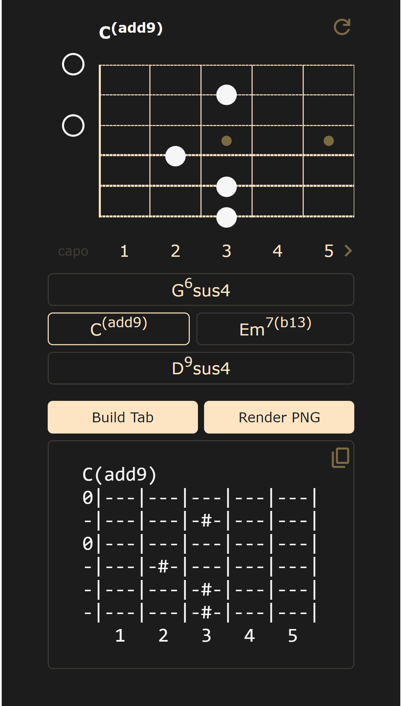

***
Chord Drawer is a single-page application, that allows to find name, build tab
and render image of guitar chord. It's pretty easy to use: 

- build chord on fretboard,
- choose preferable name from possible variations
- press button.

Then you can copy tab to clipboard or download generated image.

